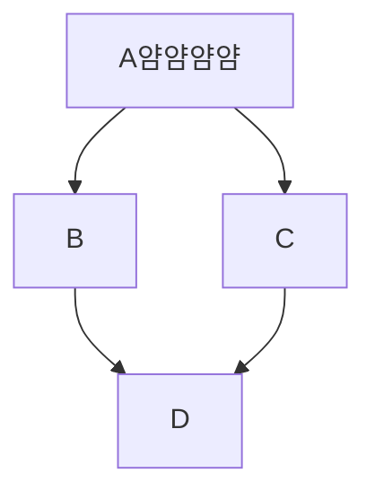
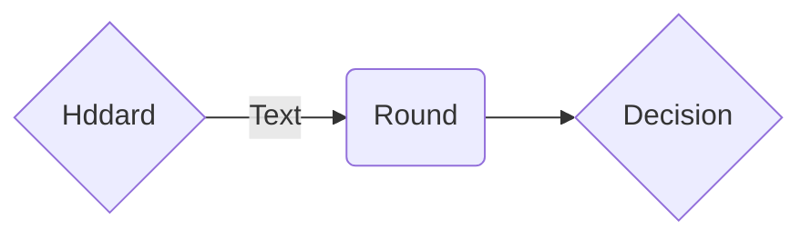
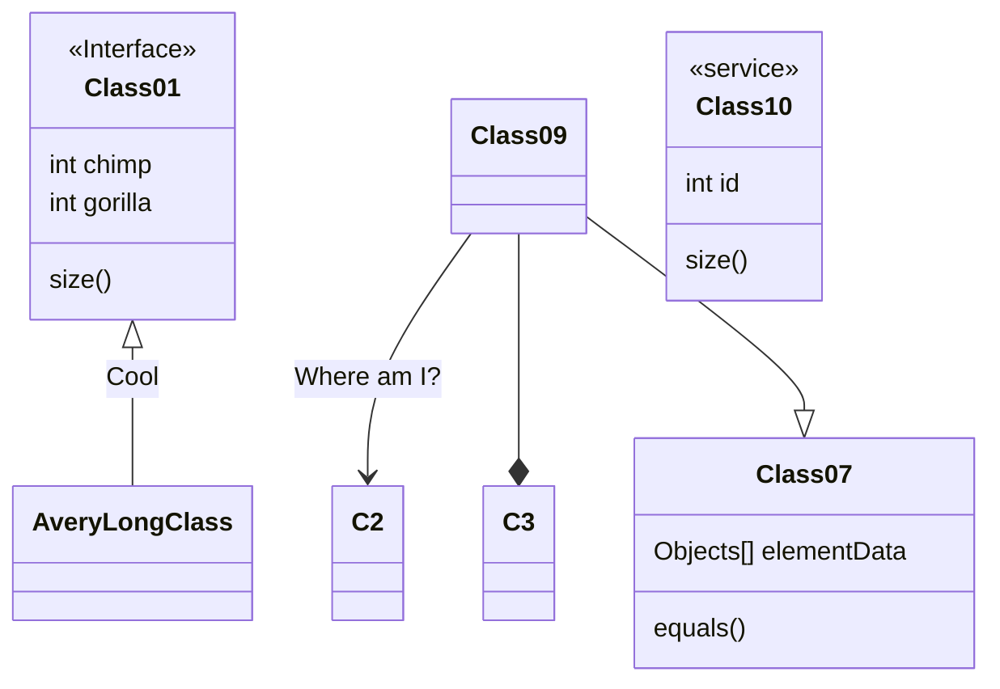
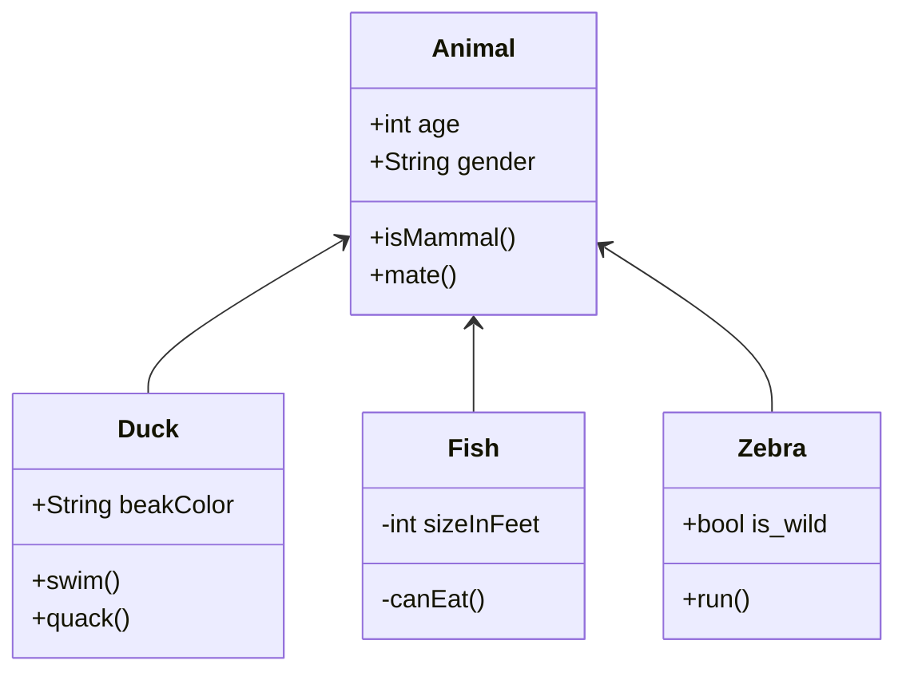
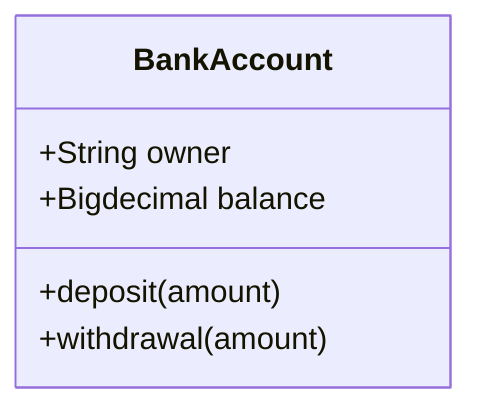
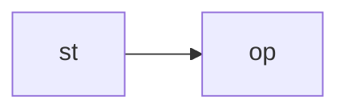

This is an H1
================

hello
'ctrl'+'spacebar': 자동완성
graph, flowchart, class???? ddx?

flowchart: 가로인가봐!!
[] : 네모

() : 각이 둥근 네모

{} : 마름모

| | : 화살표중간에 텍스트

----------------------------------

--------------------------
st=>start: Start
op=>operation: Your Operation
cond=>condition: Yes or No?
e=>end

st->op->cond
cond(yes)->e
cond(no)->op

